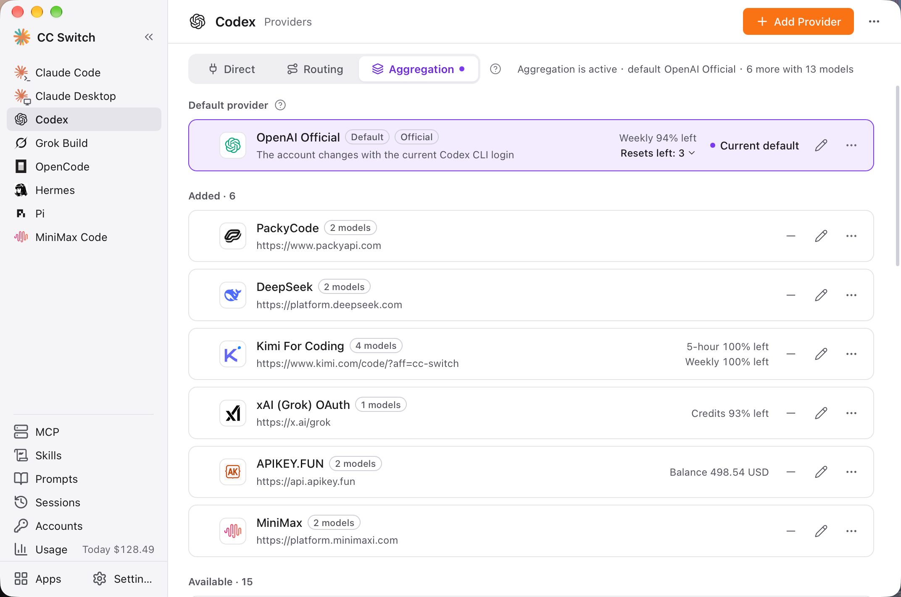

# 4.6 集約モード

## 機能説明

集約モードは、複数のプロバイダーのモデルを Claude Code または Codex の同じモデル一覧にまとめます。クライアントの `/model` で選んだモデルに応じてリクエストが該当のプロバイダーに送られるため、CC Switch に戻ってプロバイダーを切り替える必要がありません。

集約モードは **Claude Code** と **Codex** のみに対応しています。

## ルーティングとの違い

| | ルーティング | 集約 |
|------|------|------|
| 同時に使うプロバイダー | 1 社（またはフェイルオーバーキューに従って交代） | 複数。選んだモデルに応じて振り分け |
| フェイルオーバー | 対応 | 非対応 |
| プロバイダーの切り替え方法 | CC Switch で切り替える | クライアントの `/model` でモデルを選ぶ |
| 対応アプリ | Claude Code / Codex / Gemini CLI / Grok Build | Claude Code / Codex のみ |

どちらもこのマシンのルーティングサービスを経由するため、CC Switch を起動し続ける必要があります。1 つのアプリは、同時に直接接続・ルーティング・集約のいずれか 1 つのモードにしかなれません。

## 集約モードに入る

### 操作場所

サイドバーで Claude Code または Codex を選択 → ページ上部の「集約」タブ

### 操作手順

1. 「集約」タブをクリックします。タブをクリックしても表示が切り替わるだけで、設定は変わりません
2. 「既定のプロバイダー」エリアで既定のプロバイダーを確認します（後述）
3. 「集約に切り替え」をクリックします
4. 表示される確認ダイアログで、既定のプロバイダーと `/model` に表示されるモデルを確認し、「集約に切り替え」で確定します

切り替えると、ページに「集約が有効 · 既定」と、既定のプロバイダーおよびほかの何社・合計何モデルが追加されているかが表示されます。直接接続に戻すには「直接接続に戻す」をクリックします。ルーティングに切り替えるには、「ルーティング」タブの「ルーティングを開始」をクリックします。

## プロバイダーの追加と削除

### 追加

「集約」タブの「追加できるもの」リストには、まだ追加していないプロバイダーが並んでいます。カードの「追加」をクリックすると、そのプロバイダーのモデルがクライアントのモデル一覧に表示されます。

### 削除

「追加済み」リストで、カードの「削除」をクリックします。追加済みのプロバイダーは、クライアントの設定にも同時に書き込まれます。

> ⚠️ 既定のプロバイダーは削除できません。先に別のプロバイダーを既定にしてください。

### 各プロバイダーのモデルを設定する

プロバイダーを編集するときに、フォームに「モデル一覧」があります：

- これらのモデルが `/model` に表示され、選ぶとリクエストがそのプロバイダーに直接送られます
- 先頭（★）がそのプロバイダーの既定モデルです。そのプロバイダーが既定に設定されている場合、Claude Code の起動時とバックグラウンドタスク、Codex の既定モデルにこれが使われます
- モデルを設定していないプロバイダーは、集約に追加しても `/model` にモデルが増えません
- 「手動で追加」でモデルを補えます

## 既定のプロバイダー

既定のプロバイダーは、プレフィックスのないすべてのリクエストを受けます。プロバイダーカードの「既定にする」で変更できます。

公式サブスクリプション（Claude 公式アカウント、Codex の OpenAI Official）を使っている場合は、公式アカウントを既定のプロバイダーにしてください。

## `/model` の `ccs-` プレフィックス

既定のプロバイダー以外の追加済みプロバイダーのモデルは、`ccs-` プレフィックス付きで `/model` に表示されます。`ccs-` プレフィックス付きのモデルを選ぶと、リクエストは対応するプロバイダーに送られます。プレフィックスなしのモデルを選ぶと、既定のプロバイダーに送られます。

> 同じセッションの途中でモデルを変えると、新しいモデルでプロンプトキャッシュを作り直すため、最初の 1 ターンは費用が高くなります。Claude Code は 2.1.243 以降が必要です。

## 再起動が必要なとき

| アプリ | 集約のモデル一覧が変わったとき |
|------|------------------|
| Claude Code | すぐに反映 |
| Codex | 完全な再起動が必要 |

Codex はモデル一覧を起動時にしか読み込みません。集約に入る・抜ける、プロバイダーを追加・削除する、プロバイダーのモデルを変更するといった操作の後、ページに「Codex が古いモデル一覧を使っているため、集約したモデルが表示されません」と表示されます。クライアントの形態に応じて次のように対処します：

- **CLI**：codex を開き直すだけでは足りません。案内にある「Codex デーモンを再起動」をクリックしてください。すべてのターミナルの codex がこのデーモンを共有しているため、実行中のタスクは中断されます
- **デスクトップ版**：完全に終了してから開き直します。macOS では ⌘Q を押します。ウィンドウを閉じるだけでは不十分です
- **エディター拡張**：エディターのウィンドウを開き直します

また、CC Switch がクライアント設定を書き換えるたびに、`/model` で集約したモデルを選択している場合は、もう一度選び直す必要があります。

## 制限事項

- **フェイルオーバーはしません**：集約モードの間もキューと設定は保持され、ルーティングモードに戻すと復元されます
- **公式アカウントは既定のプロバイダーにしかできず**、集約には追加できません
- **既定のプロバイダーは削除できません**
- **CC Switch を起動し続ける必要があります**：CC Switch を終了すると自動的に直接接続に戻り、次回の起動時に再び接続されます
- ルーティングモードに戻すと、集約したモデルは `/model` から外れます（リストは保持）。選択中の集約したモデルは通常のモデルに戻す必要があります

## 謝辞

集約モードの設計の多くは [opencodex](https://github.com/lidge-jun/opencodex) を参考にしています。作者とコントリビューターの皆さんに感謝します。
