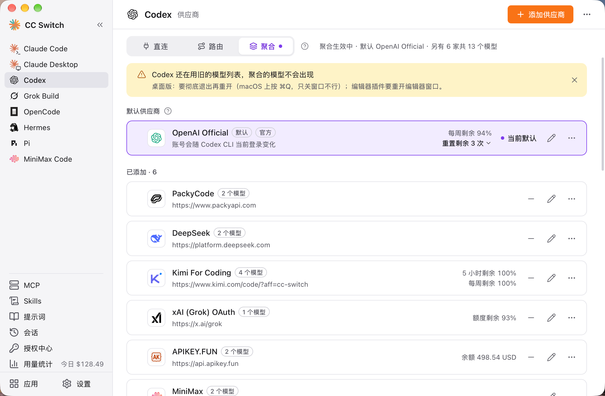
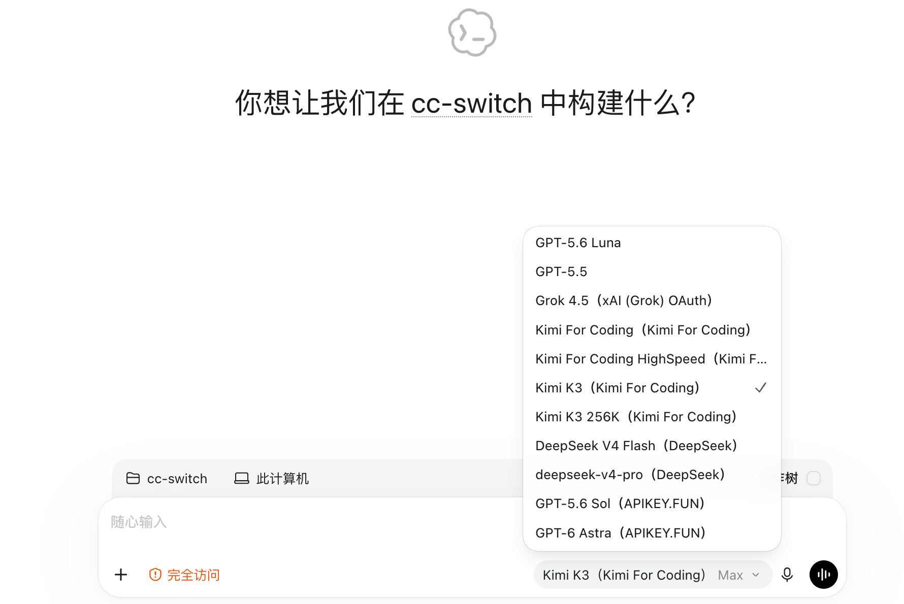

# 4.6 聚合模式

## 功能说明

聚合模式把多家供应商的模型放进 Claude Code 或 Codex 的同一个模型列表。在客户端的 `/model` 里选哪个模型，请求就发给哪一家，不用回到 CC Switch 切换供应商。

聚合模式只支持 **Claude Code** 和 **Codex**。

## 与路由的区别

| | 路由 | 聚合 |
|------|------|------|
| 同一时间使用的供应商 | 一家（或按故障转移队列轮换） | 多家，按所选模型分发 |
| 故障转移 | 支持 | 不支持 |
| 切换供应商的方式 | 在 CC Switch 里切换 | 在客户端 `/model` 里选模型 |
| 适用应用 | Claude Code / Codex / Gemini CLI / Grok Build | 仅 Claude Code / Codex |

两者都经过本机的路由服务，所以都需要 CC Switch 保持运行。一个应用同一时间只能处于直连、路由、聚合三种模式之一。

## 进入聚合模式

### 操作位置

侧栏选择 Claude Code 或 Codex → 页面顶部的「聚合」标签

### 操作步骤

1. 点「聚合」标签。点标签只是查看，不会改动配置
2. 在「默认供应商」区域确认默认供应商（见下文）
3. 点“切换到聚合模式”
4. 在弹出的确认框里查看默认供应商和将出现在 `/model` 里的模型，点“切换到聚合模式”确认

切换后页面会显示“聚合生效中 · 默认”，以及默认供应商和另外几家共多少个模型。回到直连点“回到直连”，改用路由点「路由」标签里的“开始路由”。

## 添加和移除供应商

### 添加

在「聚合」标签下，「可添加」列表里是还没加入的供应商。点卡片上的“添加”，这家的模型就会出现在客户端的模型列表里。

### 移除

「已添加」列表里点卡片上的“移除”。已添加的供应商会同时写进客户端的配置。

> ⚠️ 默认供应商不能移除，请先把别的供应商设为默认。

### 设置每家的模型

编辑供应商时，表单里有「模型列表」：

- 这些模型会出现在 `/model` 里，选中后请求直达这家
- 第一个（★）是这家的默认模型；这家被设为默认时，Claude Code 启动和后台任务、Codex 的默认模型都用它
- 没有配置模型的供应商，加入聚合后不会在 `/model` 里多出任何模型
- 可以点“手动添加”补充模型

## 默认供应商

默认供应商承接所有不带前缀的请求。在供应商卡片上点“设为默认”可以更换。

如果你在用官方订阅（Claude 官方账号、Codex 的 OpenAI Official），请把官方账号设为默认供应商。

## `/model` 里的 `ccs-` 前缀

除默认供应商外，其他已添加的供应商，它们的模型会以 `ccs-` 前缀出现在 `/model` 里。选择带 `ccs-` 前缀的模型，请求发给对应的那一家；选择不带前缀的，请求发给默认供应商。

> 同一会话里换模型后，新模型要重新建立提示词缓存，第一轮费用会高一些。Claude Code 需要 2.1.243 或更新版本。

## 什么时候需要重启

| 应用 | 聚合模型列表变化后 |
|------|------------------|
| Claude Code | 立即生效 |
| Codex | 需要彻底重启 |

Codex 只在启动时读取模型列表。进入或退出聚合、添加或移除供应商、改动某家的模型后，页面会提示“Codex 还在用旧的模型列表，聚合的模型不会出现”，按客户端形态处理：

- **命令行**：重开 codex 不够，要点提示里的“重启 Codex 守护进程”。所有终端里的 codex 共用这个守护进程，正在运行的任务会被中断
- **桌面版**：彻底退出再重开。macOS 上按 ⌘Q，只关窗口不行
- **编辑器插件**：重开编辑器窗口

另外，CC Switch 每次改写客户端配置后，如果 `/model` 里当前选的是聚合的模型，需要重新选一次。

## 限制

- **不做故障转移**：聚合模式下队列和设置会保留，回到路由模式后恢复
- **官方账号只能作默认供应商**，不能加入聚合
- **默认供应商不能移除**
- **需要 CC Switch 保持运行**：退出 CC Switch 会自动回到直连，下次启动再接上
- 回到路由模式时，聚合的模型会从 `/model` 撤下（名单保留），已选中的聚合模型需要改回普通模型

## 致谢

聚合模式的许多设计参考了 [opencodex](https://github.com/lidge-jun/opencodex)，感谢作者和贡献者。
